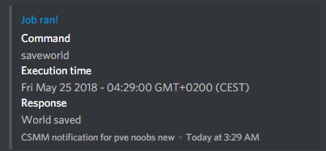

Discord
===========

Chat bridge
--------------

Chat from discord directly to the game.

CSMM will automatically grab new messages from the game and send them to your specified discord channel. (and from discord to game aswell)

.. image:: ../images/discord-chatbridge.png

Make sure you have the bot in your Discord guild.

Admins can configure certain prefixes to be blocked from chat bridge. This is useful to reduce clutter.
If you want to make your chatbridge public, it is recommended to turn "rich messages" off. This will make chatbridge display a basic "playername connected" message instead of steam IDs and countries.

*Note: make sure the bot has read, send messages permission and permission to embed links!*

Commands
----------

**Multiple 7dtd servers per discord guild**

A note for users who have more than one 7DTD server linked to a discord guild. CSMM needs to be able to differentiate between servers. That's why all commands can take one extra argument at the end, a server identifier.

Use the "listservers" discord command to see a list of servers associated with this guild, if you want to execute a command for a second server, you'll add that servers identifier at the end of a command.
By default, this argument is 1.

So for example, if you have 2 servers associated with a guild

"$status" will respond with status for server 1. To get status for your second server, you will use "$status 2"

Another example:
"$ex say "sends a message to first server""

"$ex say "sends a message to third server" 3"

** Starting and ending command arguments when they contain spaces **

When a command takes an argument that can contain spaces, you will also need to start and end your arguments properly. Consider the following

"$ex say test" - This will send a message to server one
"$ex say another test" - This will think that 'test' is the server identifier! This is **bad syntax**

The correct way is this: "$ex say "another test""

Status
^^^^^^^^

Aliases: d7, day7

Quickly see some basic info about the server

.. image:: ../images/discord-command-status.png

Listservers
^^^^^^^^

Quick and basic list of the server you have

.. image:: ../images/discord-command-listservers.png

Serverinfo
^^^^^^^^

Detailed infomation about your server and settings 

.. image:: ../images/discord-command-serverinfo.png

Top
^^^^^^^^

Which players have spent the most time on your server?

Arguments: 
  -  *type* What type of data do you want to see the top players of? This can be: 'playtime', 'zombies', 'players', 'deaths', 'currency', 'level' or 'score'
  -  *amount* The amount of players to show. maximum 20.

.. image:: ../images/discord-command-top-playtime.png

Which players have killed the most zombies on your server?

.. image:: ../images/discord-command-top-zombies.png

Which players have died the most on your server?

.. image:: ../images/discord-command-top-deaths.png

Which players have killed the most players on your server?

.. image:: ../images/discord-command-top-players.png

Which players have the most currency on your server?

.. image:: ../images/discord-command-top-currency.png

Which players have the highest level on your server?

.. image:: ../images/discord-command-top-level.png

Which players have the highest score your server?

.. image:: ../images/discord-command-top-score.png

Player
^^^^^^^^
    
Detailed player profile lookup. This command will only show information that is okay to show to all your players. This should be used in public channels (as opposed to lookup).

Search by name, steam ID or entity ID

.. image:: ../images/Discord-player-command.png

Admin commands 
---------------------

Lookup
^^^^^^^^
    
Detailed player profile lookup. In contrast to the player command, this will show info like IP, location. This command should be used in admin channels

Search by name, steam ID or entity ID
    
.. image:: ../images/Discord-Lookup-command.png

Ex
^^^^^^
CSMM can run console commands for you from discord. Only users who are registered as owner or admin of a server on CSMM can use this command.

.. image:: ../images/discord-command-excommand.png

Notifications
----------
**Ticket Notfiication**

Notifications for $calladmin tickets. You will receive a notification when a new ticket or comment is made.

.. image:: ../images/Discord-ticket-notification.png

**Lost and Connected Notification**

Get notified when csmm loses and connects to your server. 

.. image:: ../images/Discord-connection-notification.png

**CSMM Restart Notfiication**

A notification that shows when csmm restarts. This is usually when CSMM gets updated or there are issues with the service.

.. image:: ../images/Discord-restart-notification.png

**Chatbridge Notfiication**

A notifcation that updates you on chat bridge status.

.. image:: ../images/Discord-chatbridge-notification.png

**Country Ban Notfiication**

A notification that shows when a player gets kicked or banned by the countryban module.

.. image:: ../images/Discord-countryBan-notification.jpg

**Cron Job / Server Automation Notification**

A notification that shows when a automated job has been run. This could also be used to keep a periodic log of some command output.

Configuration
-------------

All discord configuration can be done via the settings page in your servers dashboard.

