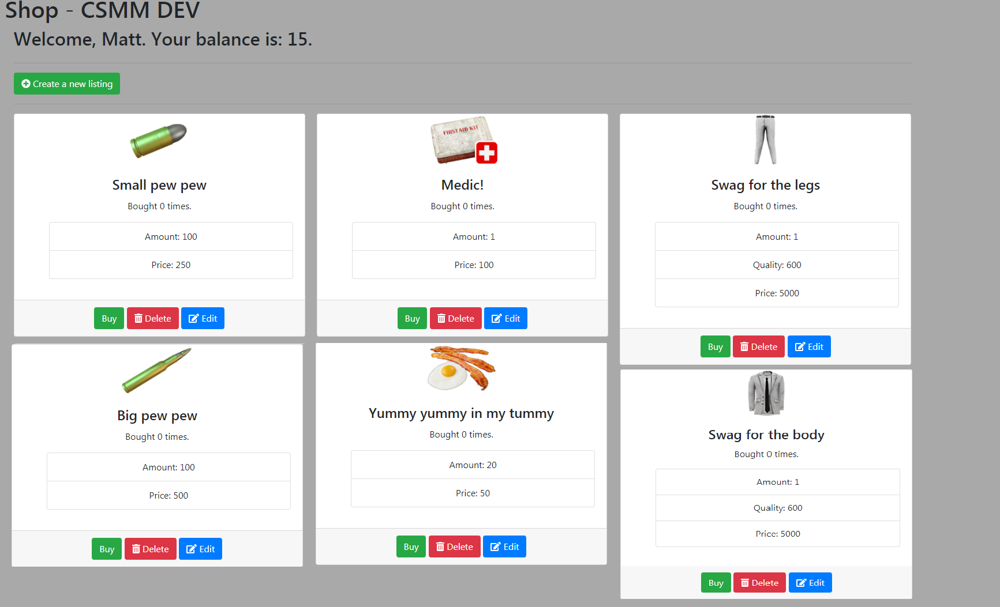

Economy
---------

The economy module allows admins to set a cost to multiple actions (teleports, custom commands, ...).

It is highly configurable, you decide what modules to enable or disable, set the prices or name your currency.

Playtime earner
^^^^^^^^^^^^^^^^

Allow players to earn money for being online on the server. Timer and amount can be configured.

Discord text earner
^^^^^^^^^^^^^^^^^^^^^

Allow players to earn money by typing in Discord. You can configure a timeout for messages, so players cannot spam to earn money.

** Players must link their Discord profile to CSMM in order for this to work. **

Kill earner
^^^^^^^^^^^^^

Allow players to earn money for killing players or zombies.

Shop
^^^^^^

Admins can add items to the shop, set the amount quality and price. These will have infinite stock.

Players can go to the same page or use the ingame "$shop" command, to be presented with a menu of items they can purchase. After purchasing, players can claim their items via the ingame "$claim" command.
    

    
Shop allows you to import / export your listings for easy configuration. The data is displayed in JSON format. In order to import your new config, you must make sure the syntax is 100% correct. A handy tool to check your syntax is `here <https://jsoneditoronline.org/>`_.