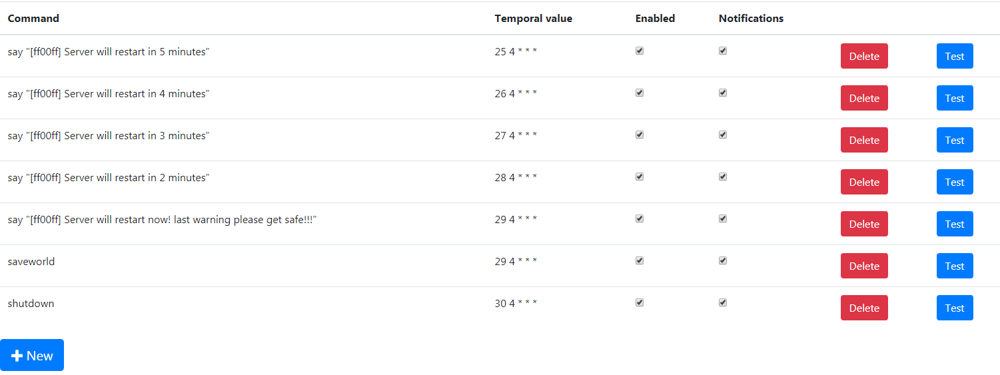

In-game features
=================

Country ban
-----------

Select countries that you do not wish on your server. CSMM will automatically kick or ban anyone joining from an IP in these countries.

**Note** This is very naive protection. Users can get around this with VPN/proxies. This'll keep casuals out, but if someone REALLY wants to get in this will not suffice.

Commands
--------

calladmin
^^^^^^^^^^

Let a player create a support ticket. Admins can get notified of this ticket and can view/comment on it via the website. CSMM will collect inventory and location data to display along the ticket.

Custom commands
^^^^^^^^^^^^^^^^

Admins can create custom ingame commands. You can set delay, timeout, cost of the command.

**Note: If a custom command has same name as an existing csmm command, the existing csmm command will always take precendence. the custom command never gets executed.**

For example: 

$discord::

    say linkToDiscord

You can execute multiple commands by separating with ";"::

    say "Here is one message";say "Here is the second!"

You have access to the players steam and entity ID with "${steamId}" and "${entityId}"::

    sayplayer ${entityId} "WAZAAAAAAAAAAAAA"

Examples

$safehouse::

    teleportplayer ${entityId} 15 85 -53; sayplayer ${steamId} "You are safe now."

$animals::

    spawnmultipleentity ${entityId} 5 @ 59 59 60 61
    
$animals-advanced::

    spawnmultipleentity ${entityId} 5 @ 59 59 59 59 64

$brutality::

    say "Die Bitch" ;spawnmultipleentity ${entityId} 15 @ 2 3 4 5 6 9 15 15 15 17 18 19 21 31 31 35 40 40 45 46 53 56 63 63 63 63 64 67 67 67 70

Spawnmultipleentity is a coppis command for anyone without see example below::

    Spawnentity ${entityId} 59 ;Spawnentity ${entityId} 59
    
Cron job / Automation commands
--------------------------------

Cron jobs allow you to configure commands to run at specific time intervals. You can set up a job to run every x minutes or hours.

Advanced users can also use the cron syntax to define their jobs. This allows much more control and 'cool stuff' you can do.

To get you started with the cron syntax, you can use this very helpful website https://crontab.guru/

Common use cases are automatic server restarts with a countdown, infoticker messages. Advanced users can customize this to create special server events. Let us know if you make some cool stuff with this! :)

    
Message of the day
------------------

Set a message to be sent to players when they join the server and/or show this message periodically to all players.

This is useful to advertise your discord server, remind people to abide by the rules etc

**Note: the periodic messages are deprecated, you should use the server automation feature. In the future, MOTD will only be shown when players connect to the server.**

Support tickets
-----------------

Players can create support tickets with the corresponding "calladmin" command (if enabled). This is a great way for players to ask admins for some assistance, even when there is no admin currently online.

