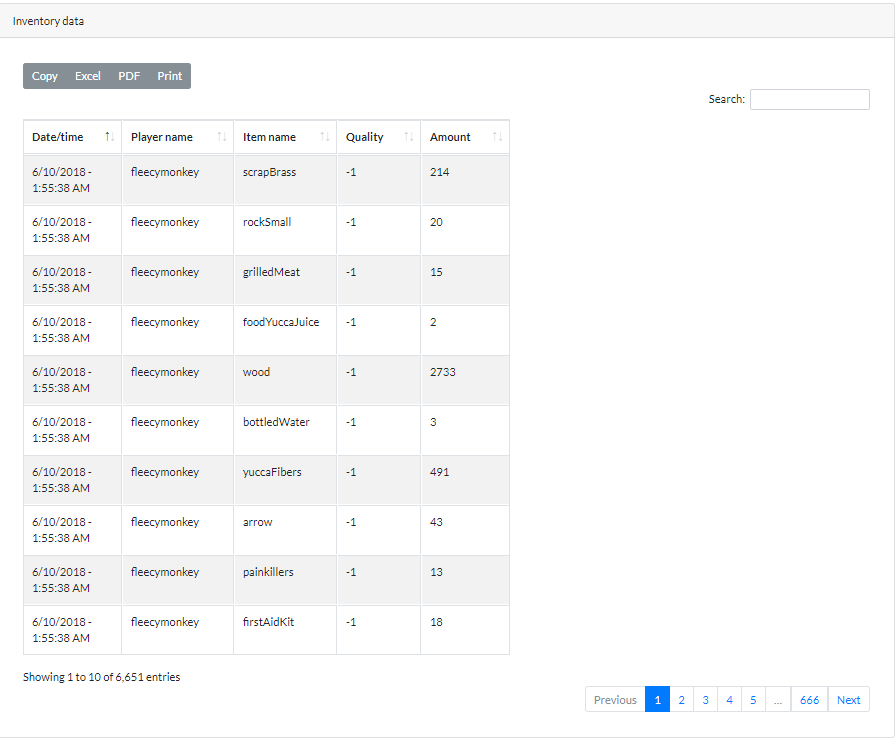

Player tracking
=======================

CSMM can take a snapshot of online players on your server every 30 seconds. It can store location and inventory data.

.. raw:: html
   :file: ../images/tracking/trackinggif.html

This information can be queried from the player tracking page on the website.

CSMM can show you the inventory changes for every player in your query.

.. image:: ../images/Features-inventory-changes.png

You can also consult the raw inventory or location data. If you specified a location to search in, distance will also be calculated.

